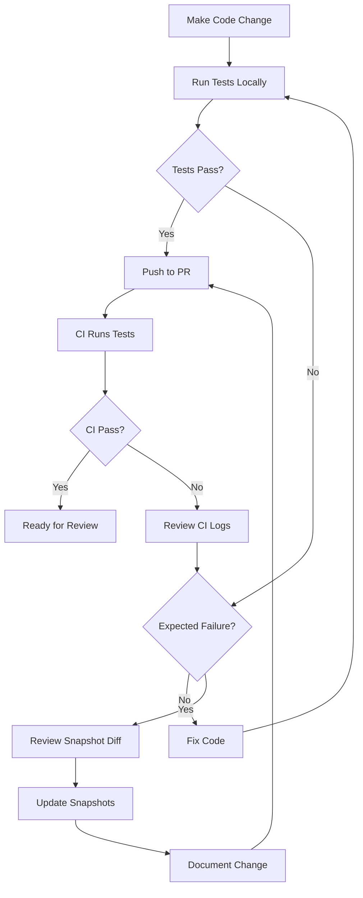

# Snapshot Tests: Workflow and CI Guidance

## Overview

Snapshot tests capture the complete externally observable behavior of the Fluxora streaming contract at critical state transitions. They provide cryptographic assurance that contract behavior remains stable across code changes, protecting integrators (wallets, indexers, treasury tools) from silent semantic drift.

## What Snapshot Tests Capture

Snapshot tests record the complete contract state after each operation, including:

- **Persistent Storage**: All stream data, recipient indexes, configuration
- **Events**: Complete event payloads with all fields
- **Authorization**: Required signers and authorization trees
- **Token Transfers**: All token movements (deposits, withdrawals, refunds)
- **Error Conditions**: Structured error codes and panic messages

## Scope and Protocol Semantics

### Authorization Boundaries

Each snapshot test explicitly documents:

1. **Who may trigger the operation**: sender, recipient, admin, or permissionless
2. **What proof they must supply**: signature requirements and authorization context
3. **What operations are impossible**: unauthorized access attempts and their error codes

### Success Semantics

Snapshot tests capture crisp success conditions:

- **State Transitions**: Status changes (Active → Paused → Active, Active → Completed, Active → Cancelled)
- **Numeric Invariants**: Accrual calculations, withdrawal amounts, refund calculations
- **Event Emissions**: Complete event payloads with all fields populated correctly
- **Storage Updates**: Persistent fields match documented behavior

### Failure Semantics

Snapshot tests capture crisp failure conditions:

- **Structured Errors**: `ContractError` variants with specific codes
- **No Silent Drift**: Failed operations leave no side effects in storage
- **Authorization Failures**: Explicit rejection with `Unauthorized` error
- **State Validation**: Operations on invalid states return `InvalidState`

## Snapshot Test Directory Structure

```
contracts/stream/test_snapshots/
└── test/
    ├── test_create_stream_initial_state.1.json
    ├── test_withdraw_mid_stream.1.json
    ├── test_cancel_stream_partial_refund.1.json
    ├── test_pause_and_resume.1.json
    └── ... (one .json file per snapshot test)
```

Each `.json` file contains:

- Complete contract storage state
- All emitted events with full payloads
- Authorization context and required signers
- Token transfer operations

## Writing Snapshot Tests

### Test Structure

```rust
#[test]
fn test_operation_scenario() {
    let ctx = TestContext::setup();

    // 1. Setup: Create initial state
    ctx.env.ledger().set_timestamp(0);
    let stream_id = ctx.create_default_stream();

    // 2. Execute: Perform the operation under test
    ctx.env.ledger().set_timestamp(500);
    let result = ctx.client().withdraw(&stream_id);

    // 3. Assert: Verify observable behavior
    assert_eq!(result, 500);
    let state = ctx.client().get_stream_state(&stream_id);
    assert_eq!(state.withdrawn_amount, 500);
    assert_eq!(state.status, StreamStatus::Active);

    // Snapshot is automatically captured by soroban-sdk
}
```

### Naming Conventions

Test names must be descriptive and follow this pattern:

```
test_<operation>_<scenario>_<expected_outcome>
```

Examples:

- `test_create_stream_initial_state` - Stream creation with valid parameters
- `test_withdraw_before_cliff_panics` - Withdrawal attempt before cliff time
- `test_cancel_already_cancelled_panics` - Double cancellation attempt
- `test_pause_and_resume` - Pause/resume state transition cycle

### Edge Cases to Cover

#### Time-Based Edge Cases

- **Before cliff**: Operations attempted before `cliff_time`
- **At cliff**: Operations exactly at `cliff_time`
- **After cliff**: Operations after `cliff_time` but before `end_time`
- **At end**: Operations exactly at `end_time`
- **After end**: Operations after `end_time`
- **Cancellation freeze**: Operations on cancelled streams

#### Numeric Edge Cases

- **Zero amounts**: Withdrawal when nothing is accrued
- **Partial amounts**: Withdrawal of less than fully accrued
- **Full amounts**: Withdrawal of entire deposit
- **Overflow protection**: Maximum values for deposit, rate, duration
- **Precision**: Rounding behavior in accrual calculations

#### Status Combinations

- **Active → Paused**: Valid pause operation
- **Paused → Active**: Valid resume operation
- **Active → Completed**: Full withdrawal completing stream
- **Active → Cancelled**: Sender cancellation with refund
- **Paused → Cancelled**: Cancellation of paused stream
- **Invalid transitions**: Attempts to resume Active, pause Completed, etc.

## Updating Snapshots

### When to Update

Update snapshots when:

1. **Intentional behavior change**: You deliberately modify contract logic
2. **Event schema change**: You add/remove/rename event fields
3. **Storage layout change**: You modify persistent data structures
4. **Error handling change**: You add new error codes or change error conditions

### How to Update

```bash
# Review current test failures
cargo test -p fluxora_stream

# If failures are expected due to intentional changes:
# 1. Review the diff carefully
# 2. Verify the new behavior matches your intent
# 3. Set environment variable to accept new snapshots
SOROBAN_SNAPSHOT_UPDATE=1 cargo test -p fluxora_stream

# Verify snapshots were updated
git diff contracts/stream/test_snapshots/

# Commit with descriptive message
git add contracts/stream/test_snapshots/
git commit -m "test: update snapshots for [specific change]"
```

### Review Checklist

Before committing snapshot updates:

- [ ] Review every changed `.json` file in `test_snapshots/`
- [ ] Verify storage changes match intended behavior
- [ ] Verify event payloads contain all required fields
- [ ] Verify authorization requirements are correct
- [ ] Verify error codes match documentation
- [ ] Update relevant documentation if behavior changed
- [ ] Add comment in PR explaining why snapshots changed

## CI Integration

### Snapshot Validation in CI

The CI pipeline automatically validates snapshots on every push and PR:

```yaml
# .github/workflows/ci.yml
test:
  name: Test
  runs-on: ubuntu-latest
  steps:
    - name: Run tests
      run: cargo test -p fluxora_stream --features testutils -- --nocapture
```

**Snapshot tests will fail if**:

- Actual contract behavior differs from recorded snapshots
- Storage state doesn't match snapshot
- Event payloads differ from snapshot
- Authorization context differs from snapshot

### Handling Snapshot Failures in CI

When CI fails due to snapshot mismatches:

1. **Review the failure**: Check CI logs for specific differences
2. **Reproduce locally**: Run `cargo test -p fluxora_stream` to see the diff
3. **Determine cause**:
   - **Unintentional change**: Fix the code to restore original behavior
   - **Intentional change**: Update snapshots and document in PR
4. **Update if intentional**: Use `SOROBAN_SNAPSHOT_UPDATE=1` locally, review, commit
5. **Document in PR**: Explain why snapshots changed and what behavior changed

### Snapshot Update Workflow for PRs



## Integration with Audit Process

### Auditor Workflow

Snapshot tests provide auditors with:

1. **Complete behavior catalog**: Every test documents a specific scenario
2. **Cryptographic verification**: Snapshots prove behavior hasn't drifted
3. **Authorization proof**: Each snapshot shows required signers
4. **Event verification**: Complete event payloads for off-chain indexing

### Audit Checklist

Auditors should verify:

- [ ] All critical paths have snapshot coverage
- [ ] Authorization boundaries are explicit in snapshots
- [ ] Error conditions produce correct error codes
- [ ] No silent state changes on failed operations
- [ ] Event emissions match documentation
- [ ] Storage updates are atomic and consistent

## Best Practices

### Test Coverage

Ensure snapshot coverage for:

1. **All public entry points**: Every `pub fn` in contract implementation
2. **All error paths**: Every `ContractError` variant
3. **All state transitions**: Every status change
4. **All authorization paths**: Sender, recipient, admin, permissionless
5. **All edge cases**: Time boundaries, numeric limits, status combinations

### Test Independence

Each snapshot test must be:

- **Isolated**: No shared state between tests
- **Deterministic**: Same input always produces same output
- **Complete**: Captures all observable behavior
- **Minimal**: Tests one scenario per test function

### Documentation

Each snapshot test should include:

```rust
/// Test that [operation] [scenario] [expected outcome].
///
/// # Authorization
/// - Requires: [who must authorize]
/// - Proof: [what authorization is needed]
///
/// # Success Semantics
/// - State: [expected state changes]
/// - Events: [expected events emitted]
/// - Tokens: [expected token movements]
///
/// # Failure Semantics
/// - Error: [expected error code if applicable]
/// - Side effects: [none, or specific rollback behavior]
#[test]
fn test_operation_scenario() {
    // Test implementation
}
```

## Troubleshooting

### Common Issues

#### Snapshot Mismatch After Dependency Update

**Symptom**: Tests fail after updating `soroban-sdk` version

**Solution**:

```bash
# Verify behavior is still correct
cargo test -p fluxora_stream

# If behavior is correct, update snapshots
SOROBAN_SNAPSHOT_UPDATE=1 cargo test -p fluxora_stream

# Document in commit
git commit -m "test: update snapshots for soroban-sdk 21.7.7 → 21.8.0"
```

#### Flaky Snapshot Tests

**Symptom**: Tests pass locally but fail in CI, or vice versa

**Causes**:

- Non-deterministic test data (use fixed addresses, not random)
- Time-dependent behavior (use `env.ledger().set_timestamp()`)
- Uninitialized state (ensure `TestContext::setup()` is complete)

**Solution**: Ensure all test inputs are deterministic

#### Large Snapshot Diffs

**Symptom**: Snapshot update produces large, hard-to-review diffs

**Solution**:

- Break change into smaller commits
- Update snapshots incrementally
- Add detailed commit messages explaining each change
- Consider if change is too large and should be split

## References

- [Soroban SDK Testing Guide](https://docs.rs/soroban-sdk/latest/soroban_sdk/testutils/index.html)
- [Fluxora Audit Documentation](./audit.md)
- [Fluxora Streaming Protocol](./streaming.md)
- [Contributing Guidelines](../CONTRIBUTING.md)

## Residual Risks

### Explicitly Excluded from Snapshot Coverage

The following are intentionally not covered by snapshot tests:

1. **Gas costs**: Snapshots don't capture execution costs (see `docs/gas.md`)
2. **TTL behavior**: Storage expiration is not tested in snapshots
3. **Network-specific behavior**: Testnet vs mainnet differences
4. **Token contract implementation**: Assumes standard SAC behavior

### Rationale

These exclusions are justified because:

- **Gas costs**: Measured separately in gas benchmarks
- **TTL behavior**: Tested in dedicated TTL tests
- **Network differences**: Documented in deployment guides
- **Token behavior**: Assumed to follow Stellar Asset Contract standard

### Mitigation

Residual risks are mitigated by:

- Separate test suites for excluded concerns
- Explicit documentation of assumptions
- Integration testing on testnet before mainnet deployment
- Audit review of all assumptions
