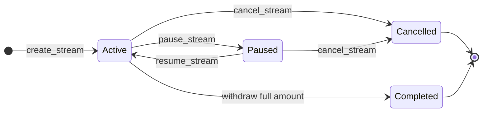
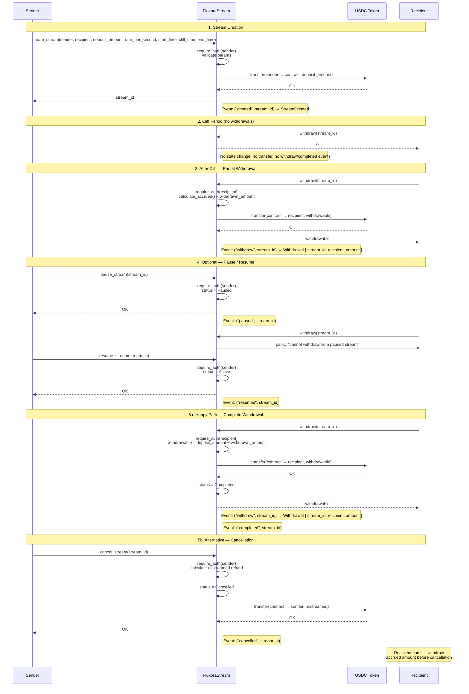

# Fluxora Stream Contract Documentation

Onboarding and integration reference for developers and auditors. Describes stream lifecycle, accrual formula, cliff/end_time behavior, access control, events, and error codes.

**Source of truth:** `contracts/stream/src/lib.rs`, `contracts/stream/src/accrual.rs`

## Sync Checklist

When changing the contract:

- Update this doc if you change lifecycle, access control, events, or panic messages
- Run `cargo test -p fluxora_stream` before committing
- No behavior change required for doc-only updates

---

## 1. Stream Lifecycle

### Phases

| Phase            | Action                                       | Notes                                                                   |
| ---------------- | -------------------------------------------- | ----------------------------------------------------------------------- |
| **Creation**     | `create_stream`                              | Sender deposits tokens; stream starts as `Active`                       |
| **Top-up**       | `top_up_stream`                              | Extra deposit locked (sender or admin only); schedule unchanged         |
| **Pause**        | `pause_stream` / `pause_stream_as_admin`     | Stops withdrawals; accrual continues by time                            |
| **Resume**       | `resume_stream` / `resume_stream_as_admin`   | Restores withdrawals                                                    |
| **Cancellation** | `cancel_stream` / `cancel_stream_as_admin`   | Refunds unstreamed amount to sender; accrued amount stays for recipient |
| **Withdrawal**   | `withdraw` / `withdraw_to` / `batch_withdraw` | Recipient pulls accrued tokens                                       |
| **Completion**   | Automatic                                    | When `withdrawn_amount == deposit_amount`, status becomes `Completed`   |

### State Transitions

- **Active** ↔ **Paused** (via pause/resume)
- **Active** or **Paused** → **Cancelled** (terminal)
- **Active** → **Completed** (when recipient withdraws full deposit; terminal)

Terminal states: `Completed`, `Cancelled`. They cannot transition to any other state.

### Cancellation Semantics (Issue Scope)

This section is the protocol-level contract for `cancel_stream` and `cancel_stream_as_admin`.

Success semantics (observable):

1. Preconditions: stream status is `Active` or `Paused`.
2. `cancelled_at` is set to current ledger timestamp.
3. Accrued amount is frozen at `cancelled_at` (no post-cancel time growth).
4. Refund is `deposit_amount - accrued_at_cancelled_at`.
5. Stream transitions to terminal `Cancelled` state.
6. `StreamCancelled` event is emitted with topic `("cancelled", stream_id)`.

Failure semantics (observable):

1. Missing stream: `ContractError::StreamNotFound`.
2. Non-cancellable status (`Completed` or already `Cancelled`): `ContractError::InvalidState`.
3. Unauthorized caller on sender path: authorization failure from `sender.require_auth()`.
4. Unauthorized caller on admin path: authorization failure from `admin.require_auth()`.
5. Any failure is atomic: no refund transfer, no state mutation, no cancel event.

Role boundaries:

1. `cancel_stream`: only the stream `sender` can authorize.
2. `cancel_stream_as_admin`: only contract `admin` can authorize.
3. Recipient and third parties cannot cancel through either path unless they hold required credentials.

Invariants after successful cancellation:

1. `status == Cancelled` and `cancelled_at.is_some()`.
2. `calculate_accrued(stream_id)` always returns accrued at `cancelled_at`.
3. `refund + frozen_accrued == deposit_amount`.
4. Recipient may withdraw only frozen accrued remainder (`frozen_accrued - withdrawn_amount`).

Scope boundary and exclusions:

1. In scope: refund math, `cancelled_at` persistence/freeze semantics, cancel auth paths, cancel event consistency.
2. Out of scope: token-level trust assumptions beyond documented model, off-chain indexer liveness, and economic policy choices (for example who should bear operational costs).
3. Residual risk: if a non-standard token violates SEP-41 expectations, transfer behavior may diverge; CEI ordering reduces but cannot fully eliminate external token risk.



### Sequence Diagram

The following diagram shows the full create → withdraw flow, including optional pause/resume and cancel paths.



---

## 2. Accrual Formula

**Location:** `contracts/stream/src/accrual.rs`

```text
if current_time < cliff_time           → return 0
if start_time >= end_time or rate < 0  → return 0

elapsed_now = min(current_time, end_time)
elapsed_seconds = elapsed_now - start_time   // 0 if underflow
accrued = elapsed_seconds * rate_per_second  // on overflow → deposit_amount
return min(accrued, deposit_amount).max(0)
```

### Rules

- **Before cliff:** Returns 0 (no withdrawals allowed)
- **After cliff:** Accrual computed from `start_time`, not from cliff
- **No cliff:** Set `cliff_time = start_time` for immediate vesting
- **After end_time:** Elapsed time is capped at `end_time` (no post-end accrual)
- **Overflow:** Multiplication overflow yields `deposit_amount` (safe upper bound)
- **Active streams:** Accrual computed using current ledger timestamp
- **Paused streams:** Accrual computed using current ledger timestamp (same as Active; pause only blocks withdrawals, not accrual)
- **Completed:** `calculate_accrued` returns `deposit_amount` (deterministic final value, timestamp-independent)
- **Cancelled:** `calculate_accrued` is frozen at `cancelled_at` (no post-cancel growth)

### Status-Specific Behavior Matrix

| Status     | Time Source            | Expected Behavior                         |
|------------|------------------------|-------------------------------------------|
| Active     | env.ledger().timestamp| Accrual grows with wall-clock time        |
| Paused     | env.ledger().timestamp| Same as Active (accrual continues)        |
| Completed  | N/A (ignored)         | Returns deposit_amount (deterministic)    |
| Cancelled  | cancelled_at          | Frozen at cancellation time               |

### Withdrawable Amount

```text
withdrawable = accrued - withdrawn_amount
```

### Frontend: get_claimable_at (simulation)

`get_claimable_at(stream_id, timestamp)` is a read-only view that returns the amount that would be claimable (withdrawable) at an arbitrary timestamp. Use it for:

- **Planning:** "How much will be claimable at time T?" without sending a transaction.
- **Simulation:** Pass a future timestamp to show projected claimable amount.
- **Consistency:** For the current ledger time, result matches `get_withdrawable(stream_id)`.

Behaviour: Active/Paused streams use the given `timestamp` (clamped to schedule); Cancelled streams use `min(timestamp, cancelled_at)` so accrual is frozen at cancellation. Completed streams return 0.

---

## 3. Cliff and end_time Behavior

### Cliff

- Must be in `[start_time, end_time]` (enforced at creation)
- Before `cliff_time`: accrued = 0, no withdrawals
- At or after `cliff_time`: accrual uses elapsed time from `start_time`, not cliff

### end_time

- Must satisfy `start_time < end_time`
- Accrual uses `min(current_time, end_time)` as the upper bound
- After `end_time`, accrued stays at `min((end_time - start_time) * rate_per_second, deposit_amount)`
- No extra accrual beyond `end_time`

### Deposit Validation

At creation:

```text
deposit_amount >= rate_per_second * (end_time - start_time)
```

The same sufficiency check is enforced when extending a stream's `end_time`:

```text
deposit_amount >= rate_per_second * (new_end_time - start_time)
```

If the existing deposit does not cover the extended duration, `extend_stream_end_time` panics with `"deposit_amount must cover total streamable amount for extended schedule"` and no state changes occur. Use `top_up_stream` first to increase the deposit, then extend.

### Start Time Boundary (Creation)

- `start_time` **must be >= current ledger timestamp** at creation time.
- `start_time == now` is valid ("start now").
- `start_time < now` is rejected with `ContractError::StartTimeInPast`.
- Failure is atomic: no stream is persisted, no tokens move, and no `created` event is emitted.

**Limits Policy (Defense in Depth):**

- No arbitrary hard-coded caps (e.g. "max 1M tokens").
- The technical upper bound is `i128::MAX` or the underlying token's total supply.
- Rationale: Accrual math (in `accrual.rs`) is already overflow-safe via `checked_mul` and clamping.
- Application-specific limits should be handled in the frontend or factory contracts.

---

## 4. Access Control

| Function                 | Authorized Caller | Auth Check                 |
| ------------------------ | ----------------- | -------------------------- |
| `init`                   | Bootstrap admin signer (once) | `admin.require_auth()` |
| `create_stream`          | Sender            | `sender.require_auth()`    |
| `create_streams`         | Sender            | `sender.require_auth()` (once per batch) |
| `pause_stream`           | Sender            | `sender.require_auth()`    |
| `resume_stream`          | Sender            | `sender.require_auth()`    |
| `cancel_stream`          | Sender            | `sender.require_auth()`    |
| `withdraw`               | Recipient         | `recipient.require_auth()` |
| `withdraw_to`            | Recipient         | `recipient.require_auth()` |
| `batch_withdraw`         | Recipient         | `recipient.require_auth()` (once per batch) |
| `calculate_accrued`      | Anyone            | None (view)                |
| `get_withdrawable`       | Anyone            | None (view)                |
| `get_claimable_at`       | Anyone            | None (view)                |
| `get_config`             | Anyone            | None (view)                |
| `get_stream_state`       | Anyone            | None (view)                |
| `pause_stream_as_admin`  | Admin             | `admin.require_auth()`     |
| `resume_stream_as_admin` | Admin             | `admin.require_auth()`     |
| `cancel_stream_as_admin` | Admin             | `admin.require_auth()`     |
| `close_completed_stream` | Anyone            | None (permissionless cleanup) |
| `top_up_stream`          | Funder address    | `funder.require_auth()`    |
| `update_rate_per_second` | Sender            | `sender.require_auth()`    |
| `shorten_stream_end_time`| Sender            | `sender.require_auth()`    |
| `extend_stream_end_time` | Sender            | `sender.require_auth()`    |

**Note:** Sender-managed functions (`pause_stream`, `resume_stream`, `cancel_stream`) require sender auth. Admin uses separate `_as_admin` entry points.

### batch_withdraw: completed stream behavior

`batch_withdraw` processes each stream ID in order. A stream with status `Completed` **does not panic** — it contributes a zero-amount result (`BatchWithdrawResult { stream_id, amount: 0 }`) and is skipped silently. No token transfer and no event are emitted for that entry. This allows callers to pass a mixed list of active and already-completed streams without pre-filtering.

A `Paused` stream **does** panic and reverts the entire batch.
### One-Shot Init and Immutable Bootstrap

`init(token, admin)` has explicit externally observable bootstrap semantics:

- One-shot: first successful call writes `Config { token, admin }` and `NextStreamId = 0`.
- Auth boundary: the supplied `admin` address must authorize the call.
- Re-init failure: any second call panics with `"already initialised"`.
- Failure atomicity: failed auth or re-init leaves bootstrap storage unchanged.
- Immutability boundary: `token` is immutable after init; `admin` can rotate only via `set_admin` with current-admin auth.

Residual assumption: deployment flow must ensure the intended bootstrap admin signs the first init transaction.

### create_streams: Batch Atomicity and Single Auth

`create_streams(sender, streams)` is the batch creation entrypoint for treasury operators and indexers.

- Single auth: only `sender` must authorize, and it is checked once for the entire batch.
- Batch validation: every entry is validated before token transfer or persistence.
- Atomic transfer: the contract pulls exactly `sum(deposit_amount)` once.
- Atomic persistence: if any entry fails validation (or total-deposit sum overflows), no stream is created.
- Event behavior: on success, one `created` event is emitted per created stream; on failure, no `created` events are emitted.
- Ordering guarantee: returned stream IDs are contiguous and in the same order as input entries.

Scope note: these guarantees are limited to `create_streams` creation semantics. They do not change withdrawal, pause/resume, cancellation, or cleanup rules.

### withdraw: Recipient-Only Auth and Completion Transition

`withdraw(stream_id)` enforces recipient-only authorization and deterministic completion semantics:

- Auth boundary: only the stream `recipient` can authorize `withdraw`.
- Non-recipient calls fail before transfer/state/event side effects.
- Zero-withdrawable path returns `0` and emits no withdraw/completed events.
- Completion transition: only an `Active` stream can transition to `Completed` on final drain.
- Cancelled streams may still be withdrawn (accrued portion), but status remains `Cancelled`.
- Event ordering on active final drain: `withdrew` is emitted before `completed`.

---

## 5. Events

### Event Schema

#### StreamCreated

Emitted when a new stream is created via `create_stream` or `create_streams`.

**Topic:** `("created", stream_id)`

**Payload:** `StreamCreated` struct containing:

- `stream_id` (u64): Unique identifier for the stream
- `sender` (Address): Address that created and funded the stream
- `recipient` (Address): Address that receives the streamed tokens
- `deposit_amount` (i128): Total tokens deposited
- `rate_per_second` (i128): Streaming rate in tokens per second
- `start_time` (u64): When streaming begins (ledger timestamp)
- `cliff_time` (u64): When tokens first become available (vesting cliff)
- `end_time` (u64): When streaming completes (ledger timestamp)

#### Withdrawal

Emitted when a recipient successfully withdraws tokens via `withdraw`.

**Topic:** `("withdrew", stream_id)`

**Payload:** `Withdrawal` struct containing:

- `stream_id` (u64): Unique identifier for the stream
- `recipient` (Address): Address that received the tokens
- `amount` (i128): Amount of tokens withdrawn

#### Other Events

| Topic                      | Payload                                  | When Emitted                               |
| -------------------------- | ---------------------------------------- | ------------------------------------------ |
| `("created", stream_id)`   | `StreamCreated` (struct payload)         | `create_stream` / `create_streams`         |
| `("paused", stream_id)`    | `StreamEvent::Paused(stream_id)`         | `pause_stream` / `pause_stream_as_admin`   |
| `("resumed", stream_id)`   | `StreamEvent::Resumed(stream_id)`        | `resume_stream` / `resume_stream_as_admin` |
| `("cancelled", stream_id)` | `StreamEvent::StreamCancelled(stream_id)`| `cancel_stream` / `cancel_stream_as_admin` |
| `("withdrew", stream_id)`  | `Withdrawal { stream_id, recipient, amount }` | `withdraw`                           |
| `("completed", stream_id)` | `StreamEvent::StreamCompleted(stream_id)`| `withdraw` / `batch_withdraw` (active final drain) |
| `("closed", stream_id)`    | `StreamEvent::StreamClosed(stream_id)`   | `close_completed_stream`                   |
| `("top_up", stream_id)`    | `StreamToppedUp` (struct payload)        | `top_up_stream`                            |

---

## 6. Error Behavior (ContractError + Panics)

Errors are surfaced either as `ContractError` variants or as panic/assert messages.
Integrators should treat `ContractError` as stable error codes, and panic strings
as best-effort diagnostics. The table below focuses on creation and lifecycle
errors relevant to stream creation and timing.

| Message                                                                 | Function                                   | Trigger                      |
| ----------------------------------------------------------------------- | ------------------------------------------ | ---------------------------- |
| `"already initialised"`                                                 | `init`                                     | Re-init attempt              |
| authorization failure                                                   | `init`                                     | caller did not satisfy `admin.require_auth()` |
| `"deposit_amount must be positive"`                                     | `create_stream` / `create_streams`         | deposit_amount <= 0          |
| `"rate_per_second must be positive"`                                    | `create_stream` / `create_streams`         | rate_per_second <= 0         |
| `"sender and recipient must be different"`                              | `create_stream` / `create_streams`         | sender == recipient          |
| `"start_time must be before end_time"`                                  | `create_stream` / `create_streams`         | start_time >= end_time       |
| `"cliff_time must be within [start_time, end_time]"`                    | `create_stream` / `create_streams`         | cliff out of range           |
| `"deposit_amount must cover total streamable amount (rate * duration)"` | `create_stream` / `create_streams`         | underfunded                  |
| `"overflow calculating total streamable amount"`                        | `create_stream` / `create_streams`         | overflow in rate \* duration |
| `"overflow calculating total batch deposit"`                            | `create_streams`                           | overflow in sum of deposits  |
| `ContractError::StartTimeInPast`                                        | `create_stream` / `create_streams`         | start_time < ledger timestamp |
| `"stream not found"`                                                    | Various                                    | Invalid stream_id            |
| `"stream is already paused"`                                            | `pause_stream`                             | Double pause                 |
| `"stream must be active to pause"`                                      | `pause_stream`                             | Pause non-active stream      |
| `"stream is active, not paused"`                                        | `resume_stream`                            | Resume active stream         |
| `"stream is completed"`                                                 | `resume_stream`                            | Resume completed             |
| `"stream is cancelled"`                                                 | `resume_stream`                            | Resume cancelled             |
| `"stream must be active or paused to cancel"`                           | `cancel_stream` / `cancel_stream_as_admin` | Cancel completed/cancelled   |
| `"stream already completed"`                                            | `withdraw`                                 | Withdraw from completed      |
| `"cannot withdraw from paused stream"`                                  | `withdraw`                                 | Withdraw while paused        |
| `"stream is not active"`                                                | `pause_stream_as_admin`                    | Admin pause non-active       |
| `"stream is not paused"`                                                | `resume_stream_as_admin`                   | Admin resume non-paused      |
| `"can only close completed streams"`                                    | `close_completed_stream`                   | Close non-Completed stream   |
| `"contract not initialised: missing config"`                            | Functions requiring config                 | Config missing               |

## Error Reference

For a full list of contract errors, see [error.md](./error.md).
